<div align="center">

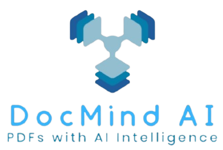

# DocMind AI

### AI-Powered PDF Learning and Knowledge Assistant

Transform your documents into an interactive learning experience with AI-powered summaries, intelligent questions, and conversational PDF analysis.

<p align="center">
  <a href="https://docmind-ai-one.vercel.app">
    
  </a>
  <a href="https://github.com/Abad-Ali/DocMind-AI">
    
  </a>
</p>

</div>

---

<div align="center">


</div>

---

## Live Application

Explore the deployed version of **DocMind AI** and view the complete source code:

<p align="left">

<a href="https://docmind-ai-one.vercel.app">

</a>

<a href="https://github.com/Abad-Ali/DocMind-AI">

</a>

</p>

### Links

**Website**  
https://docmind-ai-one.vercel.app

**Repository**  
https://github.com/Abad-Ali/DocMind-AI

---

# Table of Contents

- [Overview](#overview)
- [Screenshots & Product Preview](#screenshots--product-preview)
- [Application Preview](#application-preview)
- [Features](#features)
- [System Architecture](#system-architecture)
- [AI Processing Workflow](#ai-processing-workflow)
- [Database Design](#database-design)
- [Project Structure](#project-structure)
- [Tech Stack](#tech-stack)
- [Installation](#installation)
- [Environment Variables](#environment-variables)
- [API Overview](#api-overview)
- [Deployment](#deployment)
- [Future Improvements](#future-improvements)
- [Author](#author)
- [Usage Policy](#usage-policy)
- [Acknowledgements](#acknowledgements)
- [Final Note](#final-note)

---

## Overview

DocMind AI is a full-stack AI-powered PDF learning platform that helps users understand, analyze, and retain knowledge from documents more efficiently.

The platform allows administrators to securely upload and manage PDF documents, while authenticated users can explore, search, view, bookmark, download, share, and interact with PDFs through AI-powered features.

Users can generate:

- AI-generated document summaries
- Important study questions
- Interactive conversations with PDF content

DocMind AI uses an optimized AI workflow where generated summaries and questions are stored in MongoDB after the first generation. Future users receive cached AI responses without triggering additional AI API calls, improving performance and reducing AI processing costs.

---

## Core Idea

The goal of DocMind AI is to transform static PDF documents into intelligent learning resources.

Instead of manually reading large documents, users can:

- Understand documents faster with AI summaries
- Prepare for exams or reviews using generated questions
- Ask questions directly from PDF content
- Save important documents for future reference
- Access knowledge through an interactive AI assistant

---

# Screenshots & Product Preview

<details>
<summary><b>Click to view application screenshots</b></summary>

<br/>

<div align="center">

<table>

<tr>

<td align="center">
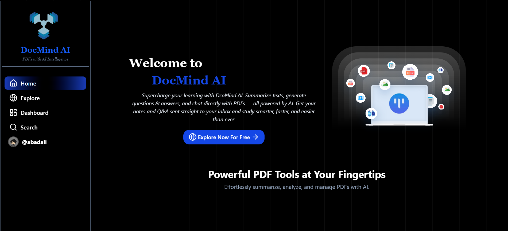
<br/>
<b>Home Page</b>
</td>

<td align="center">
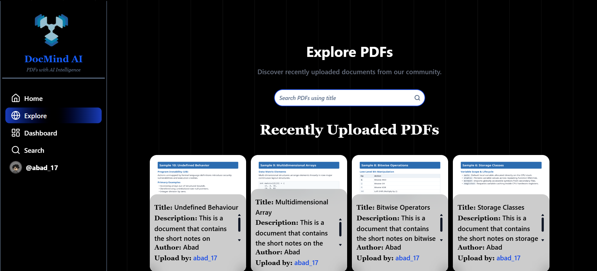
<br/>
<b>Explore Page</b>
</td>

</tr>

<tr>

<td align="center">
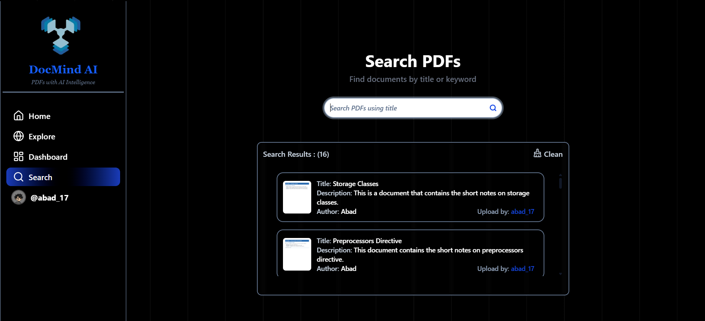
<br/>
<b>Search Page</b>
</td>

<td align="center">
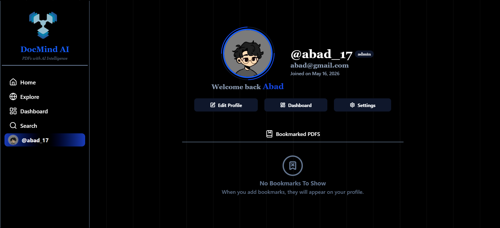
<br/>
<b>Profile Page</b>
</td>

</tr>

<tr>

<td align="center">
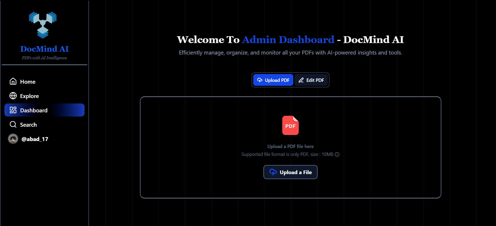
<br/>
<b>Admin Dashboard (Upload)</b>
</td>

<td align="center">
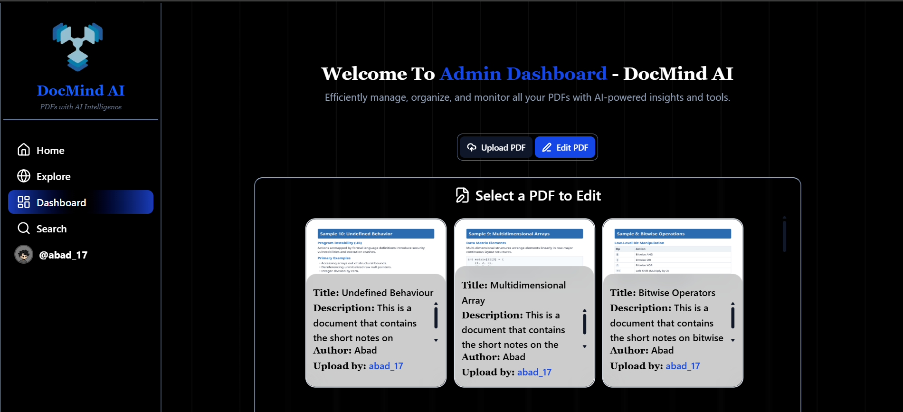
<br/>
<b>Admin Dashboard (Edit)</b>
</td>

</tr>

<tr>

<td align="center">
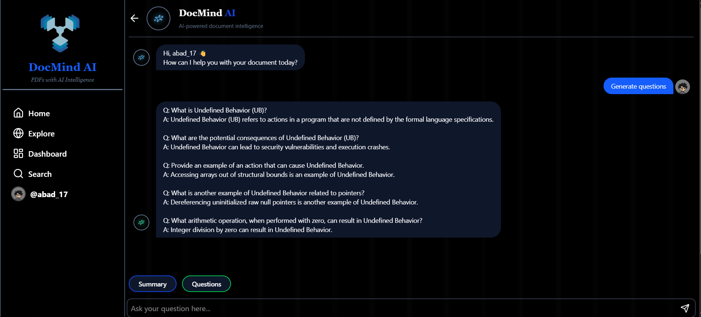
<br/>
<b>Chat With PDF</b>
</td>

<td align="center">
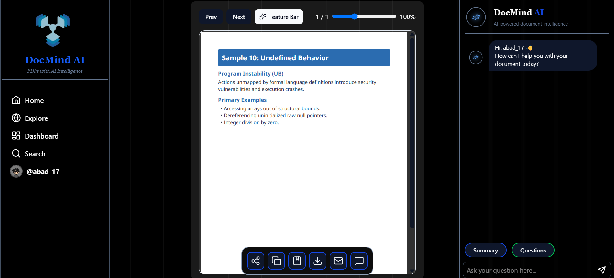
<br/>
<b>PDF Viewer</b>
</td>

</tr>

<tr>

<td align="center">

<br/>
<b>Responsive Design</b>
</td>

<td align="center">
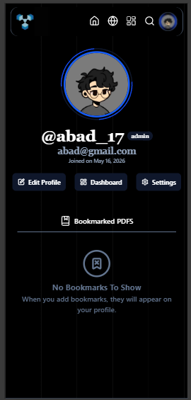
<br/>
<b>Responsive Design</b>
</td>

</tr>

</table>

</div>

</details>

---

## Application Preview

DocMind AI provides a role-based experience where both users and administrators access the same platform, while administrators have additional permissions to manage PDF content.

---

## User Workflow

Authenticated users can explore available PDFs, interact with documents, and use AI-powered learning features.

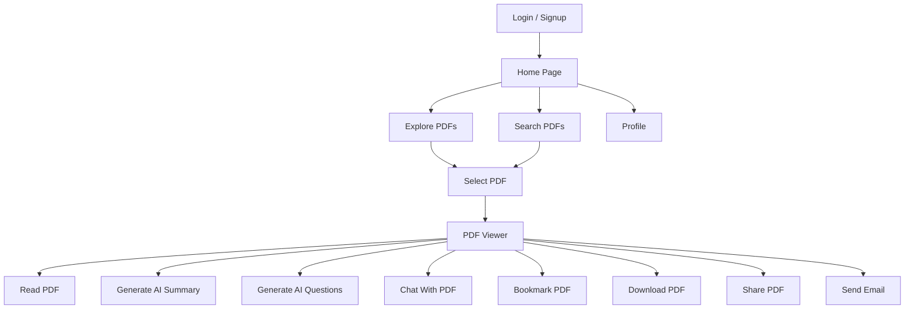

---

## Admin Workflow

Administrators have all user capabilities along with additional permissions to manage PDF documents.

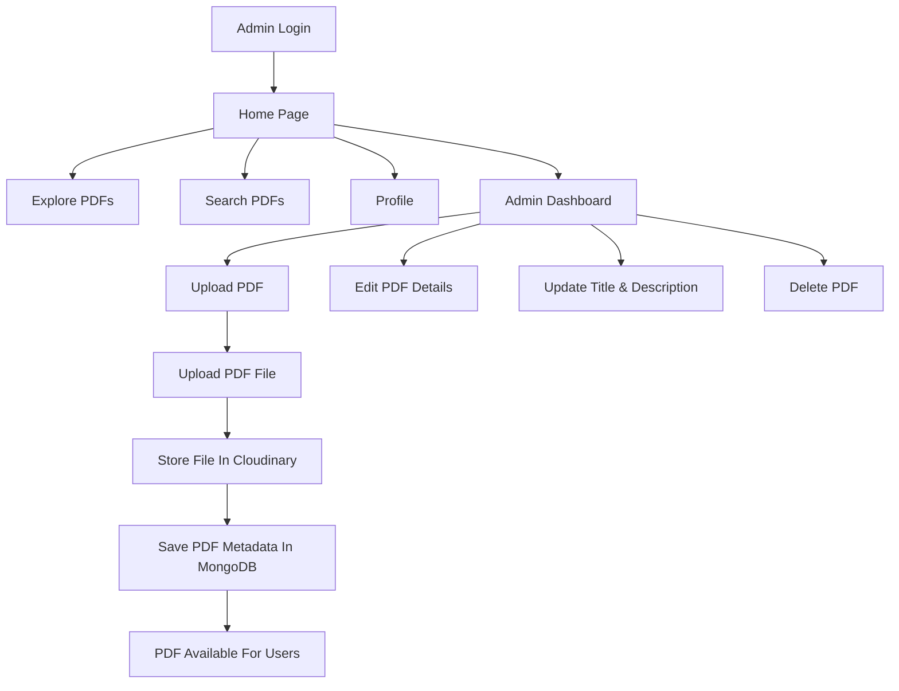

---

## PDF Interaction Flow

The PDF viewer acts as the central point where users access all document-based features.

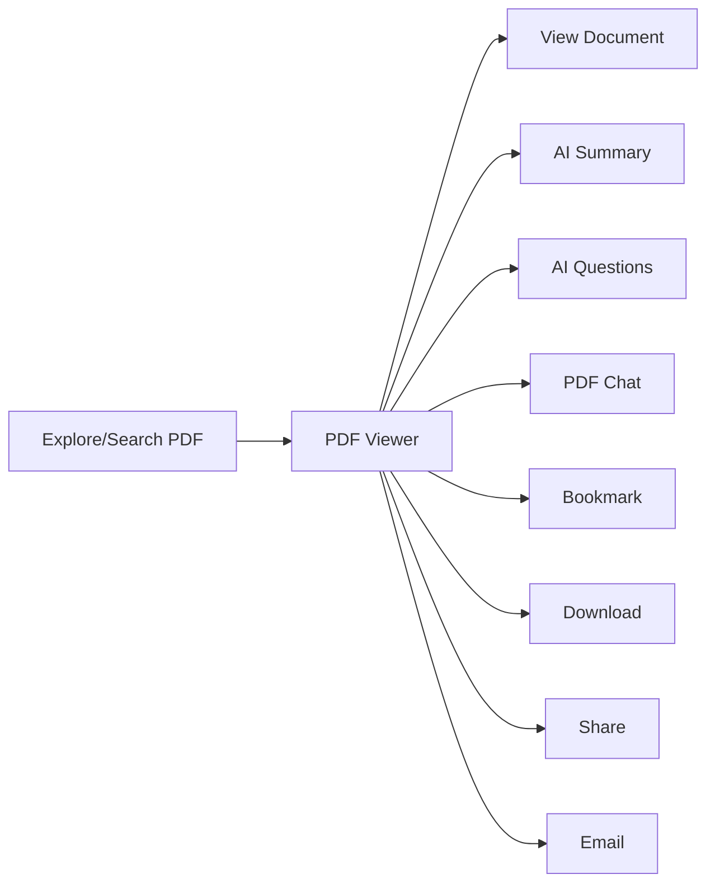

---

# Features

DocMind AI combines document management, artificial intelligence, and secure authentication to create an interactive PDF learning platform.

## Authentication & User Management

- Secure user registration and login
- JWT-based authentication
- Email verification system
- Protected routes for authenticated users
- Role-based access control
- User profile management

---

## Admin Features

Administrators have complete control over PDF content management.

- Secure admin dashboard
- Upload PDF documents
- Update PDF information
- Edit PDF title and description and can enhance them by AI
- Delete PDF documents
- Manage uploaded resources
- Publish PDFs for users

---

## User Features

Authenticated users can access and interact with available PDF resources.

- Explore available PDFs
- Search PDF documents
- View PDFs inside the application
- Bookmark important documents
- Download PDFs
- Share PDF resources
- Send PDF information through email
- Manage user profile

---

## AI-Powered Features

DocMind AI transforms static documents into interactive learning resources.

### AI Summary Generation

- Automatically extracts PDF content
- Generates concise summaries
- Stores generated summaries for future users
- Reduces unnecessary AI API calls

### AI Question Generation

- Creates important questions from PDF content
- Helps users with revision and knowledge retention
- Stores generated questions for faster access

### Chat With PDF

- Ask questions directly from PDF content
- Receive contextual AI responses
- Uses document information to generate relevant answers

### AI Content Enhancement

- Enhances PDF titles using AI suggestions
- Generates or improves PDF descriptions

---

## Performance Optimizations

DocMind AI implements multiple optimizations for better performance.

- MongoDB caching for AI-generated content
- AI API calls only on first generation
- Reusable summaries and questions
- Efficient PDF text extraction
- PDF chunk processing for AI understanding
- Cloud-based file storage using Cloudinary

---

## Security Features

- JWT authentication
- Protected API routes
- Admin authorization middleware
- Secure file upload handling
- Email verification before account activation
- Role-based permissions

---

# System Architecture

DocMind AI follows a full-stack architecture built with **Next.js, React, Redux Toolkit, Express.js, Node.js, and MongoDB**.

The system follows a layered architecture where the frontend manages user interaction, the backend handles business logic and security, and external services provide file storage, AI processing, and email communication.

The architecture is divided into the following layers:

- Frontend Layer
- Backend API Layer
- Authentication & Authorization Layer
- Document Processing Layer
- AI Processing Layer
- Database Layer
- External Services Layer


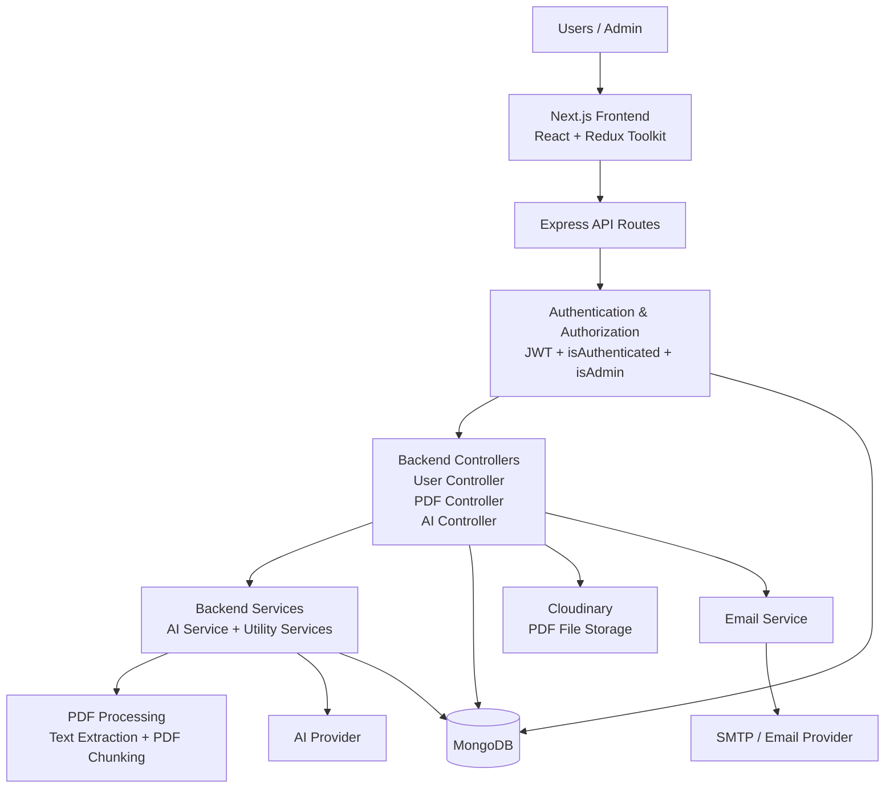
---

# AI Processing Workflow

DocMind AI uses an AI-powered document processing pipeline to analyze uploaded PDFs and generate useful learning resources such as summaries, questions, and document-based conversations.

The system processes PDF documents, extracts meaningful content, sends it for AI processing, and stores generated results in MongoDB so they can be reused by multiple users without repeated AI API requests.

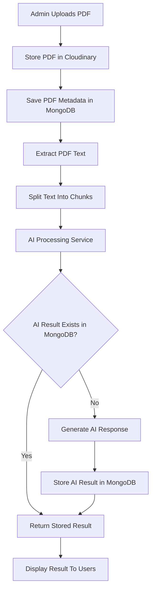

---

## AI Features

### AI Summary Generation

- Extracts relevant information from PDF content
- Generates concise document summaries
- Stores generated summaries in MongoDB
- Allows future users to access existing summaries without additional AI requests

---

### AI Question Generation

- Creates questions from PDF content
- Helps users with revision and knowledge retention
- Saves generated questions for future access

---

### Chat With PDF

- Allows users to ask questions about PDF content
- Uses extracted document information to provide contextual responses
- Helps users understand and explore documents interactively

---

### AI Title Enhancement

- Available only for administrators
- Improves PDF titles using AI assistance
- Helps create clearer and more meaningful document names

---

### AI Description Enhancement

- Available only for administrators
- Generates improved PDF descriptions
- Provides better context about uploaded documents

---

## AI Optimization Strategy

DocMind AI avoids unnecessary AI API calls by storing generated results.

The workflow:

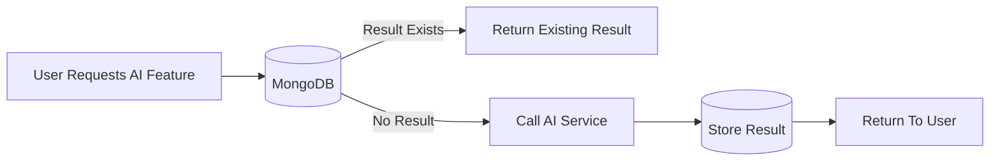

This approach provides:

- Faster response times
- Reduced AI API usage
- Better scalability
- Consistent results for all users accessing the same document

---

# Database Design

DocMind AI uses **MongoDB** with **Mongoose ODM** to manage application data. The database design focuses on user management, PDF document storage, AI-generated content storage, and efficient reuse of processed document data.

The main collections are:

- User Collection
- PDF Collection

---

## User Collection

The User collection stores authentication details, profile information, user roles, and bookmarked PDFs.

| Field | Type | Description |
|------|------|-------------|
| username | String | Unique username of the user |
| email | String | User email address |
| password | String | Encrypted user password |
| profilePicture | String | User profile image URL |
| name | String | User display name |
| gender | String | User gender preference |
| role | String | User role (`user` or `admin`) |
| bookmarks | Array | References to bookmarked PDF documents |
| isVerified | Boolean | Email verification status |
| verificationToken | String | Token used for email verification |
| createdAt | Date | Account creation time |
| updatedAt | Date | Last update time |

---

## PDF Collection

The PDF collection stores uploaded documents, extracted content, processed chunks, and AI-generated results.

| Field | Type | Description |
|------|------|-------------|
| title | String | PDF title |
| description | String | PDF description |
| author | String | Document author information |
| fileUrl | String | Cloudinary PDF file URL |
| publicId | String | Cloudinary public identifier |
| extractedText | String | Extracted PDF text content |
| chunks | Array | Processed text chunks for AI processing |
| aiSummary | String | AI-generated PDF summary |
| aiQuestions | Array | AI-generated questions with answers |
| uploadedBy | ObjectId | Reference to the admin user who uploaded the PDF |
| createdAt | Date | PDF upload time |
| updatedAt | Date | Last modification time |

---

## Embedded Documents

### PDF Chunks

PDF text is divided into smaller chunks to improve AI processing.

```javascript
{
  text: "Extracted PDF text section",
  chunkNumber: 1
}
```

Purpose:

- Maintains document text order
- Helps AI process large documents
- Improves contextual responses

---

### AI Questions

Generated questions are stored with their answers.

```javascript
{
  question: "Example question",
  answer: "Generated answer"
}
```

Purpose:

- Provides revision material
- Avoids repeated AI generation
- Allows multiple users to access existing questions

---

## Database Relationship

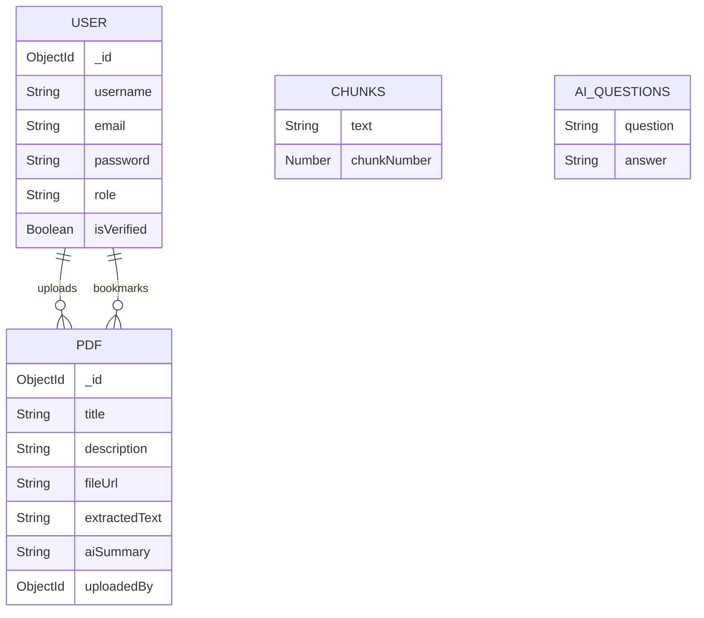

---

## Data Flow

### PDF Upload and Storage Flow


---

### AI Content Storage Flow

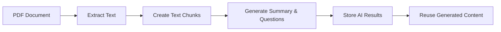

---

## Database Optimization

DocMind AI improves performance by:

- Storing AI-generated summaries and questions inside PDF documents
- Reusing existing AI results for future users
- Storing processed text chunks for PDF conversations
- Using references between users and uploaded PDFs
- Avoiding unnecessary AI API calls

---

# Project Structure

DocMind AI is divided into two main parts:

- **Backend** — Handles authentication, API logic, PDF processing, AI integration, database operations, and server-side functionality.
- **Frontend** — Handles UI, routing, state management, and user interactions.

<details>
<summary><b>Click to view complete project structure</b></summary>

```text
DocMind-AI/
│
├── backend/
│   │
│   ├── controllers/
│   │   ├── ai.controller.js
│   │   ├── pdf.controller.js
│   │   └── user.controller.js
│   │
│   ├── middlewares/
│   │   ├── isAdmin.js
│   │   ├── isAuthenticated.js
│   │   └── multer.js
│   │
│   ├── models/
│   │   ├── pdf.model.js
│   │   └── user.model.js
│   │
│   ├── routers/
│   │   ├── pdf.router.js
│   │   └── user.router.js
│   │
│   ├── services/
│   │   └── ai.service.js
│   │
│   ├── utils/
│   │   ├── cloudinary.js
│   │   ├── db.js
│   │   ├── Email.js
│   │   ├── Email.config.js
│   │   ├── EmailTemplate.js
│   │   ├── extractPdfText.js
│   │   ├── pdfChunks.js
│   │   └── datauri.js
│   │
│   ├── index.js
│   └── package.json
│
├── frontend/
│   │
│   ├── app/
│   │   ├── (auth)/
│   │   │   ├── login/
│   │   │   ├── signup/
│   │   │   └── verify-email/
│   │   │
│   │   ├── (main)/
│   │   │   ├── dashboard/
│   │   │   ├── explore/
│   │   │   ├── pdf/[id]/
│   │   │   ├── profile/
│   │   │   └── search/
│   │   │
│   │   ├── layout.js
│   │   ├── page.js
│   │   └── provider.js
│   │
│   ├── components/
│   │   ├── ui/
│   │   ├── PDFViewer.jsx
│   │   ├── LeftSideBar.jsx
│   │   ├── RecentPdfs.jsx
│   │   └── AiBar.jsx
│   │
│   ├── hooks/
│   │   ├── useGetPDF.jsx
│   │   ├── useGetRecentPdfs.jsx
│   │   ├── useGetUploadedPdfs.jsx
│   │   └── useGetUserProfile.jsx
│   │
│   ├── redux/
│   │   ├── authSlice.js
│   │   ├── pdfSlice.js
│   │   ├── recentPDFSlice.js
│   │   └── store.js
│   │
│   ├── lib/
│   ├── public/
│   ├── globals.css
│   └── package.json
│
├── screenshots
└── README.md
```

</details>

---

## Backend Structure

| Folder | Purpose |
|--------|---------|
| controllers | Handles application business logic for users, PDFs, and AI features |
| routers | Defines API endpoints |
| models | Contains MongoDB schemas using Mongoose |
| middlewares | Handles authentication, authorization, and file uploads |
| services | Contains reusable services such as AI processing |
| utils | Contains helper functions for database, email, PDF extraction, and storage |

---

## Frontend Structure

| Folder | Purpose |
|--------|---------|
| app | Contains Next.js routes and application pages |
| components | Reusable UI components |
| hooks | Custom React hooks for API operations |
| redux | Global state management using Redux Toolkit |
| lib | Utility functions |
| public | Static assets |

---

## Application Structure Pattern

```
Frontend
    |
    v
API Routes
    |
    v
Middleware
    |
    v
Controllers
    |
    v
Services / Utilities
    |
    v
Database & External Services
```

</details>

---

# Tech Stack

DocMind AI is built using modern full-stack technologies to provide secure authentication, AI-powered document processing, scalable storage, and an interactive user experience.

---

## Frontend Technologies

| Technology | Purpose |
|------------|---------|
| Next.js | React framework used for building the frontend application and routing |
| React | Building reusable user interface components |
| Redux Toolkit | Global state management for authentication and PDF data |
| React Redux | Connecting Redux state with React components |
| Tailwind CSS | Styling and responsive UI development |
| Radix UI | Accessible and reusable UI components |
| Framer Motion | Animations and interactive UI effects |
| React PDF | Rendering PDF documents inside the application |
| Axios | Making API requests between frontend and backend |
| Swiper | Creating interactive sliders and carousels |
| Sonner | Toast notifications |
| Lucide React | Icons and UI elements |

---

## Backend Technologies

| Technology | Purpose |
|------------|---------|
| Node.js | Runtime environment for backend execution |
| Express.js | Framework for creating REST APIs |
| MongoDB | Database for storing users, PDFs, bookmarks, and AI-generated content |
| Mongoose | ODM for MongoDB schema management |
| JWT | Secure authentication and session management |
| Multer | Handling PDF and image uploads |
| Nodemailer | Sending verification and PDF-related emails |
---

## AI & Document Processing

| Technology | Purpose |
|------------|---------|
| Google Gemini AI API | Powers AI features including PDF summaries, question generation, PDF conversations, and AI-based title and description enhancement |
| PDF Text Extraction | Extracts readable text content from uploaded PDF documents |
| PDF Chunk Processing | Splits extracted PDF text into smaller sections for efficient AI processing |
| MongoDB AI Caching | Stores generated summaries and questions to avoid repeated Gemini API requests |

---

## Storage & Deployment

| Technology | Purpose |
|------------|---------|
| Cloudinary | Secure PDF and image storage |
| MongoDB Atlas | Cloud database hosting |
| Vercel | Frontend deployment platform |
| Render | Backend deployment platform |

---

## Development Tools

| Tool | Purpose |
|------|---------|
| Git | Version control |
| GitHub | Source code management |
| ESLint | Code quality and consistency |
| npm | Package management |

---

# Installation

Follow the steps below to set up and run DocMind AI locally.

## Prerequisites

Before starting, make sure you have installed:

- Node.js (v18 or higher recommended)
- npm or yarn
- MongoDB database
- Cloudinary account
- Google Gemini AI API key
- Git

---

# Clone Repository

Clone the repository from GitHub:

```bash
git clone https://github.com/Abad-Ali/DocMind-AI.git
```

Navigate into the project directory:

```bash
cd DocMind-AI
```

---

# Backend Setup

Navigate to the backend folder:

```bash
cd backend
```

Install backend dependencies:

```bash
npm install
```

Create a `.env` file inside the backend directory:

```env
PORT=8000

MONGO_URI=your_mongodb_connection_string

JWT_SECRET=your_jwt_secret

CLOUDINARY_CLOUD_NAME=your_cloudinary_cloud_name
CLOUDINARY_API_KEY=your_cloudinary_api_key
CLOUDINARY_API_SECRET=your_cloudinary_api_secret

GEMINI_API_KEY=your_google_gemini_api_key

EMAIL_USER=your_email_address
EMAIL_PASSWORD=your_email_password

FRONTEND_URL=http://localhost:3000
```

Start the backend server:

```bash
npm run dev
```

The backend server will start at:

```
http://localhost:8000
```

---

# Frontend Setup

Open another terminal and navigate to the frontend folder:

```bash
cd frontend
```

Install frontend dependencies:

```bash
npm install
```

Create a `.env.local` file inside the frontend directory:

```env
NEXT_PUBLIC_API_URL=http://localhost:8000
```

Start the frontend development server:

```bash
npm run dev
```

The frontend application will start at:

```
http://localhost:3000
```

---

# Running DocMind AI Locally

After successfully running both frontend and backend servers:

```
Frontend Application
http://localhost:3000


Backend API
http://localhost:8000
```
---

# Environment Variables

DocMind AI requires environment variables for database connection, authentication, AI services, file storage, email communication, and frontend-backend communication.

Create the required environment files:

- `backend/.env`
- `frontend/.env.local`

---

# Backend Environment Variables

Create a `.env` file inside the `backend` directory.

| Variable | Description |
|----------|-------------|
| PORT | Port number on which the backend server runs |
| MONGO_URI | MongoDB database connection string |
| JWT_SECRET | Secret key used for generating and verifying authentication tokens |
| CLOUDINARY_CLOUD_NAME | Cloudinary cloud name for file storage |
| CLOUDINARY_API_KEY | Cloudinary API key |
| CLOUDINARY_API_SECRET | Cloudinary API secret |
| GEMINI_API_KEY | Google Gemini API key used for AI features |
| EMAIL_USER | Email account used for sending verification and PDF-related emails |
| EMAIL_PASSWORD | Email account password or application password |
| FRONTEND_URL | Frontend application URL used for CORS and redirects |

Example:

```env
PORT=8000

MONGO_URI=your_mongodb_connection_string

JWT_SECRET=your_jwt_secret

CLOUDINARY_CLOUD_NAME=your_cloud_name
CLOUDINARY_API_KEY=your_api_key
CLOUDINARY_API_SECRET=your_api_secret

GEMINI_API_KEY=your_gemini_api_key

EMAIL_USER=your_email
EMAIL_PASSWORD=your_email_password

FRONTEND_URL=http://localhost:3000
```

---

# Frontend Environment Variables

Create a `.env.local` file inside the `frontend` directory.

| Variable | Description |
|----------|-------------|
| NEXT_PUBLIC_API_URL | Backend API base URL used by the frontend |

Example:

```env
NEXT_PUBLIC_API_URL=http://localhost:8000
```

---

# Important Notes

- Never commit `.env` or `.env.local` files to GitHub.
- Keep API keys and database credentials private.
- Add environment files to `.gitignore`.
- Use separate environment variables for development and production deployments.

---

# API Overview

DocMind AI provides RESTful APIs built with **Express.js** for authentication, user management, PDF operations, and AI-powered document processing.

All protected routes require user authentication.

---

# Authentication & User APIs

Base Route:

```
/api/v1/user
```

| Method | Endpoint | Access | Description |
|--------|----------|--------|-------------|
| POST | `/register` | Public | Create a new user account |
| POST | `/verifyemail` | Public | Verify user email address |
| POST | `/login` | Public | Authenticate user and create session |
| GET | `/logout` | Authenticated | Logout user |
| GET | `/myprofile` | Authenticated | Get current user profile |
| PUT | `/profile/edit` | Authenticated | Update user profile information |
| GET | `/getprofile/:userId` | Authenticated | Get another user's profile |
| POST | `/changepassword` | Authenticated | Change account password |
| POST | `/become-admin` | Authenticated | Request admin role access |

---

# PDF Management APIs

Base Route:

```
/api/v1/pdf
```

| Method | Endpoint | Access | Description |
|--------|----------|--------|-------------|
| POST | `/upload` | Admin | Upload a new PDF document |
| PUT | `/edit/:pdfId` | Admin | Edit PDF details |
| POST | `/delete/:pdfId` | Admin | Delete a PDF document |
| GET | `/getlatest` | Authenticated | Get latest uploaded PDFs |
| GET | `/getuploaded` | Admin | Get PDFs uploaded by admin |
| POST | `/search` | Authenticated | Search PDF documents |
| GET | `/getpdf/:pdfId` | Authenticated | Get PDF details |
| GET | `/download/:pdfId` | Authenticated | Download PDF file |
| GET | `/extract/:pdfId` | Authenticated | Extract PDF text |
| GET | `/:pdfId/bookmark` | Authenticated | Bookmark a PDF |
| POST | `/:pdfId/sendemail` | Authenticated | Send PDF information through email |

---

# AI Feature APIs

Base Route:

```
/api/v1/pdf
```

| Method | Endpoint | Access | Description |
|--------|----------|--------|-------------|
| POST | `/:pdfId/summary` | Authenticated | Generate AI summary for PDF |
| POST | `/:pdfId/questions` | Authenticated | Generate AI questions and answers |
| POST | `/:pdfId/chat` | Authenticated | Chat with PDF content |
| POST | `/enhance-title` | Admin | Improve PDF title using AI |
| POST | `/enhance-description` | Admin | Improve PDF description using AI |

---

# API Authentication Flow

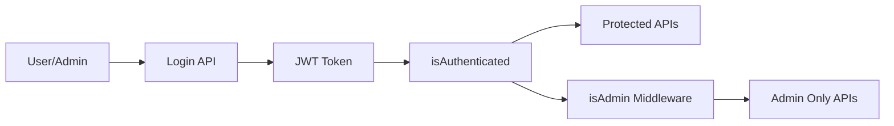

---

# API Access Control

| Role | Permissions |
|------|-------------|
| User | View PDFs, search, bookmark, download, generate AI content, chat with PDFs |
| Admin | All user permissions + upload, edit, delete PDFs, enhance title and description |

---

# Deployment

DocMind AI uses a distributed deployment architecture where the frontend and backend are deployed separately.

- **Frontend:** Deployed on Vercel
- **Backend:** Deployed on Render
- **Database:** MongoDB
- **File Storage:** Cloudinary
- **AI Processing:** Google Gemini AI API
- **Email Handling:** Nodemailer

---

## Deployment Architecture

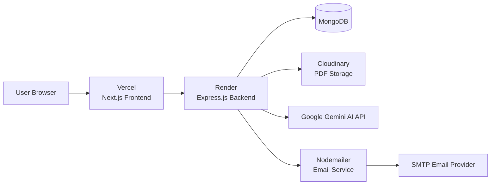

---

# Frontend Deployment (Vercel)

The Next.js frontend is deployed on Vercel.

Deployment steps:

1. Connect the GitHub repository with Vercel
2. Select the `frontend` directory as the project root
3. Configure frontend environment variables

Example:

```env
NEXT_PUBLIC_API_URL=your_backend_api_url
```

4. Deploy the application

Vercel provides:

- Automatic Next.js builds
- Production optimization
- HTTPS support
- Continuous deployment from GitHub

---

# Backend Deployment (Render)

The Express.js backend is deployed on Render.

Deployment steps:

1. Connect the GitHub repository with Render
2. Select the `backend` directory
3. Configure build and start commands

Build command:

```bash
npm install
```

Start command:

```bash
npm start
```

Add required backend environment variables:

```env
PORT
MONGO_URI
JWT_SECRET
CLOUDINARY_CLOUD_NAME
CLOUDINARY_API_KEY
CLOUDINARY_API_SECRET
GEMINI_API_KEY
EMAIL_USER
EMAIL_PASSWORD
FRONTEND_URL
```

---

# Production Request Flow

```text
User
 |
 v
Vercel
(Next.js Frontend)
 |
 v
Render
(Express Backend)
 |
 +--> MongoDB
 |    (Users, PDFs, AI Results)
 |
 +--> Cloudinary
 |    (PDF Storage)
 |
 +--> Gemini AI API
 |    (AI Processing)
 |
 +--> Nodemailer
      (Email Communication)
```

---

# Live Application

Frontend:

```
https://docmind-ai-one.vercel.app
```

Backend:

```
Deployed on Render
```
---
# Future Improvements

DocMind AI is continuously evolving. The following improvements can enhance scalability, intelligence, and user experience in future versions.

---

## AI Enhancements

- Implement vector embeddings for advanced semantic search
- Add Retrieval-Augmented Generation (RAG) for more accurate PDF conversations
- Improve AI responses using document-specific context retrieval
- Support multiple AI model providers
- Add AI-generated flashcards for better learning experience

---

## Document Management Improvements

- Support additional file formats such as DOCX and PPT
- Add PDF version history
- Implement document categories and tags
- Add advanced filtering and sorting options
- Enable collaborative document sharing

---

## User Experience Improvements

- Add personalized learning recommendations
- Add user activity history
- Implement notification system
- Add dark/light theme customization
- Improve mobile application experience

---

## Performance & Scalability Improvements

- Implement background job processing for large PDF files
- Add caching layer for frequently accessed documents
- Optimize AI processing for large documents
- Add cloud-based queue systems for scalable processing

---

## Security Improvements

- Add advanced role management
- Implement rate limiting for API protection
- Add audit logs for administrative actions
- Improve file validation and security checks

---

# Author

## Abad Ali

**Full Stack Developer**

I am a full-stack developer passionate about creating modern, scalable, and intelligent web applications that solve meaningful problems.

My work focuses on building complete software solutions by combining clean and intuitive user interfaces, secure backend architectures, efficient database systems, and practical AI integrations.

I enjoy exploring new technologies and transforming ideas into reliable applications with attention to performance, usability, and maintainability.

Through projects like **DocMind AI**, I aim to build innovative solutions that use artificial intelligence to improve productivity, learning experiences, and knowledge management.


<p align="left">

<a href="https://github.com/Abad-Ali">

</a>

<a href="https://www.linkedin.com/in/abadali-dev">

</a>

<a href="https://abadali.vercel.app">

</a>

<a href="mailto:abadali1707@gmail.com">

</a>

</p>

---

# Usage Policy

DocMind AI is an original project created and maintained by **Abad Ali**.

This repository is shared for learning, exploration, and technical reference purposes. Developers are welcome to study the source code, understand the architecture, and learn from the implementation approach.

## Ownership & Rights

All rights related to DocMind AI, including:

- Source code
- Application architecture
- UI design and components
- Branding and visual assets
- Documentation
- Original implementation details

are owned by **Abad Ali**.

This project is not released under an open-source license. All rights are reserved.

---

## Permitted Use

You are allowed to:

- Explore and review the source code
- Learn from the implementation
- Study the project architecture and technologies used
- Use the project as a reference for educational purposes
- Take inspiration from the concepts while creating your own original implementation

---

## Restricted Use

You are not allowed to:

- Claim DocMind AI as your own original work
- Copy and redistribute the complete project
- Publish or distribute modified versions without permission
- Remove or modify original author credits
- Use the project's name, logo, branding, screenshots, or assets without authorization
- Deploy or use this project as a commercial product without permission

---

## Attribution

If DocMind AI helps you learn or inspires your own work, proper acknowledgment is appreciated.

You are encouraged to create your own implementation while applying the concepts, techniques, and knowledge gained from this project.

---

# Acknowledgements

DocMind AI is built with the support of powerful open-source technologies, developer communities, and resources created by contributors around the world.

Special thanks to:

- Open-source contributors
- Framework and library maintainers
- Documentation creators
- Developer communities
- Everyone who shares knowledge and resources

Their contributions help developers build modern, scalable, and innovative applications.

---

# Final Note

Thank you for exploring **DocMind AI**.

If you find this project interesting:

- Star the repository
- Share your feedback and suggestions
- Report issues or improvements

Your support and feedback are highly appreciated.